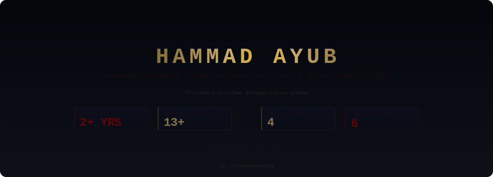

<!-- ═══════════════════════════════════════════════════════════════════════ -->
<!--                    ◈ SOVEREIGN SEAL HEADER ◈                          -->
<!-- ═══════════════════════════════════════════════════════════════════════ -->

  

<!-- ═══════════ STATUS BADGES ═══════════ -->

&nbsp;&nbsp;

&nbsp;&nbsp;

  

 

  

 

<!-- ═══════════════════════════════════════════════════════════════════════ -->
<!--                         ◈ THE ENGINEER ◈                              -->
<!-- ═══════════════════════════════════════════════════════════════════════ -->

  

 

<table>
<tr>

<td width="50%" align="center">
 

  

 

 

  
</td>

<td width="50%" align="center">
 

  

 

 

  
</td>

</tr>
<tr>
<td colspan="2" align="center">
 

&nbsp;&nbsp;

  
</td>
</tr>
</table>

 

  

 

<!-- ═══════════════════════════════════════════════════════════════════════ -->
<!--                       ◈ WHAT I ENGINEER ◈                             -->
<!-- ═══════════════════════════════════════════════════════════════════════ -->

  

 

<table>
<tr>

<td width="33%" align="center">
 

  

  
</td>

<td width="33%" align="center">
 

  

 

 

 

  
</td>

<td width="33%" align="center">
 

  

  
</td>

</tr>
</table>

 

  

 

<!-- ═══════════════════════════════════════════════════════════════════════ -->
<!--                         ◈ TECH ARSENAL ◈                              -->
<!-- ═══════════════════════════════════════════════════════════════════════ -->

  

 

<table>
<tr>
<td align="center">
 

  

  

  
</td>
</tr>
</table>

 

<table>
<tr>
<td align="center">
 

  

  

  
</td>
</tr>
</table>

 

<table>
<tr>
<td align="center">
 

  

  

  
</td>
</tr>
</table>

 

<table>
<tr>
<td align="center">
 

  

 

  
</td>
</tr>
</table>

 

<table>
<tr>
<td align="center">
 

  

  

  
</td>
</tr>
</table>

 

<table>
<tr>
<td align="center">
 

  

  
</td>
</tr>
</table>

 

  

 

<!-- ═══════════════════════════════════════════════════════════════════════ -->
<!--                         ◈ FEATURED WORK ◈                             -->
<!-- ═══════════════════════════════════════════════════════════════════════ -->

  

 

<table>
<tr>
<td width="33%" align="center" valign="top">
 

  
<b>IoT system for monitoring building lifespan</b>
  
Node.js · Fastify · MongoDB · MQTT
  
Designed schema for IoT data tracking, built RESTful APIs, integrated real-time monitoring.
  
</td>

<td width="33%" align="center" valign="top">
 

  
<b>AI diagnostic support for dental imaging</b>
  
Python · FastAPI · MongoDB · ML
  
Integrated AI models for diagnostics with scalable inference endpoints and reporting APIs.
  
</td>

<td width="33%" align="center" valign="top">
 

  
<b>Flutter restaurant management system</b>
  
Flutter · Online orders · Inventory · Analytics
  
Digitized end-to-end restaurant operations: ordering, reservations, inventory, sales reports.
  
</td>
</tr>
</table>

 

  

 

<!-- ═══════════════════════════════════════════════════════════════════════ -->
<!--                       ◈ GITHUB ANALYTICS ◈                            -->
<!-- ═══════════════════════════════════════════════════════════════════════ -->

  

 

  
  &nbsp;&nbsp;
  

 

  

 

  

 

<!-- ═══════════════════════════════════════════════════════════════════════ -->
<!--                     ◈ CONTRIBUTION TIMELINE ◈                         -->
<!-- ═══════════════════════════════════════════════════════════════════════ -->

  

 

  

 

  

 

  

 

<!-- ═══════════════════════════════════════════════════════════════════════ -->
<!--                   ◈ ISOMETRIC COMMIT CALENDAR ◈                       -->
<!-- ═══════════════════════════════════════════════════════════════════════ -->

  

 

  

 

  

 

<!-- ═══════════════════════════════════════════════════════════════════════ -->
<!--                         ◈ CERTIFICATIONS ◈                            -->
<!-- ═══════════════════════════════════════════════════════════════════════ -->

  

 

  
  
  
   
  
  
  

 

  

 

<!-- ═══════════════════════════════════════════════════════════════════════ -->
<!--                        ◈ LET'S CONNECT ◈                             -->
<!-- ═══════════════════════════════════════════════════════════════════════ -->

  

 

  
  &nbsp;&nbsp;
  
  &nbsp;&nbsp;
  
  &nbsp;&nbsp;
  

  

<!-- ═══════════════════════════════════════════════════════════════════════ -->
<!--                         ◈ PREMIUM FOOTER ◈                           -->
<!-- ═══════════════════════════════════════════════════════════════════════ -->

 

  

◈ If my work adds value to yours, a ⭐ speaks volumes ◈

 

Crafted with precision by <a href="https://github.com/hammadayub34"><b>Hammad Ayub</b></a>

  

